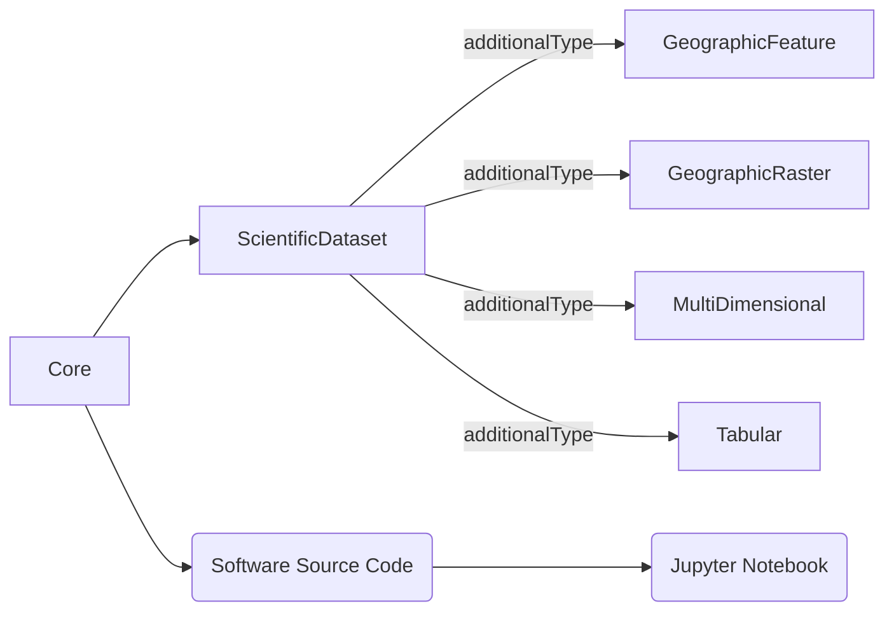

# Overview of Schema Designs

The goal of this work is to extend HydroShare’s existing resource data model to work with distributed data in the cloud. The primary focus of this work is to consolidate and simplify the implementation of how scientific metadata is stored within the HydroShare system. Our approach pivots existing functionality from reliance on a relational database to writing metadata to file(s) that are stored alongside content files. This simplifies the system and makes it easier to manage and update metadata, especially when considering distributedly hosted content. In this work we present an approach for leveraging cloud object stores for archiving scientific data in a manner that aligns with FAIR principles. This is accomplished by establishing a general pattern for describing scientific metadata that enables a low-cost, scalable, hosting solution for data repositories while also enabling individuals and organizations to host their own data in a broadly accessible manner. 

HydroShare provides a standard set of metadata elements for describing scientific content that follow the Dublin Core Metadata Initiative’s standard metadata terms. This includes fields such as title, creator, subject, description, etc. These metadata terms are supplemented with additional terms that provide further scientific context water-related content. This extension is known as “hsterms,” and includes fields such as organization, name, email address, featureCount, geometryType, etc. There have been advancements in how the community is expressing scientific metadata that we should adopt wherever possible. For example ESIP Science on Schema and CUAHSI’s I-GUIDE schema work both explore the use of Schema.Org for describing content metadata. Moreover, all public content stored in the HydroShare system provides a Schema.Org representation of metadata (expressed using JSON LD) to provide interoperability with services such as Google’s Dataset Search. By leveraging community standards, vocabularies, and methods of encapsulation for describing scientific metadata, we are able to provide consistency in how scientific data is described across multiple object stores and repositories. Schema.org provides a standardized vocabulary for structuring data on the web to support discovery, and has been adopted by major search engines such as Google, Bing, and Yahoo. Moreover, SchemaOrg is gaining traction in the scientific community, for example it’s already being used in several scientific data repositories (HydroShare, EarthChem, DataOne, ESS-Dive). We use Schema.org as the standard vocabulary for representing scientific metadata on-disk due to its versatility and wide adoption. 

# Metadata Hierarchy

Common "core" metadata is used to capture the highest-level of metadata relevant to scientific product. This could represent a scientific study, a body of work, a grouping of datasets, a single data file, etc. We will use the SchemaOrg hierarchy of “Thing” and “CreativeWork” to capture this wide range of possibilities (schema.org). The “Core” element in the figure above and largely consists of high-level metadata such as name, url, authorship, etc. Additional information can be provided by leveraging the `ScientificDataset` subclass of CreativeWork. This is useful for encapsulating metadata for a wide variety of scientific content, however this can also be extended to provide specific metadata to enable advanced features or system behaviours. Below is an overview of the relationships between these classes.

`ScientificDataset` does not use separate subclasses for each data format. Instead, a
single `ScientificDataset` type is used, and its `additionalType` property (a
controlled vocabulary defined in `schema/src/dataset.py`) indicates which format
family a given record represents: `GeographicFeature` (vector), `GeographicRaster`
(raster), `MultiDimensional` (e.g., NetCDF/Zarr), or `Tabular` (e.g., CSV/Parquet).

See [Core Metadata](core.md) for the base fields shared by all records,
[Scientific Dataset Metadata](dataset.md) for the `ScientificDataset` extension,
[Data Variable and Dimension Metadata](datavariable.md) for how variables/dimensions
are described within a `ScientificDataset`, and
[Example Implementations](examples.md) for worked examples referencing the notebooks
in `schema/notebooks/`.

